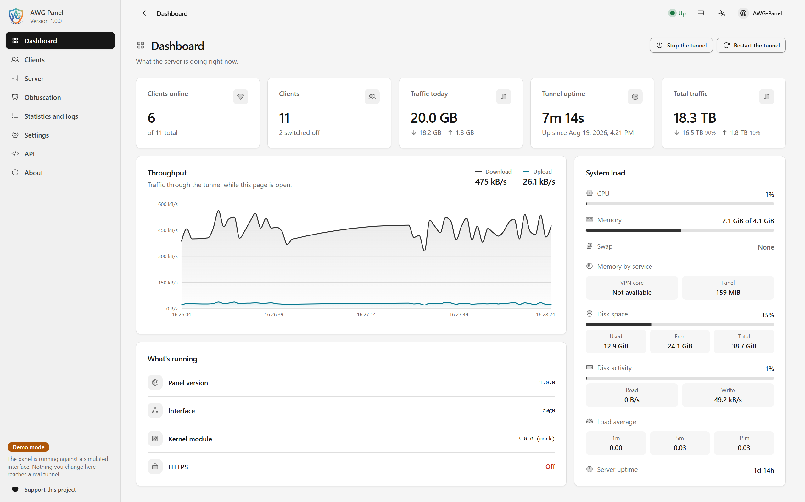

<div align="center">

**English** &nbsp;·&nbsp; [Русский](README.ru.md)


# AWG Panel

### The stealth VPN server that sets itself up

**AmneziaWG + a modern web panel. One command, one server, thousands of clients — invisible to DPI.**

<br>

[](https://github.com/achiliies/awg-panel/releases)
[](https://github.com/achiliies/awg-panel/actions/workflows/ci.yml)
[](LICENSE)
[](#installation)

<br>

[Why AmneziaWG, and why AWG Panel?](#why-amneziawg-and-why-awg-panel) &nbsp;·&nbsp; [Features](#features) &nbsp;·&nbsp; [Connect Your Devices](#connect-your-devices) &nbsp;·&nbsp; [Installation](#installation) &nbsp;·&nbsp; [Disclaimer](#disclaimer) &nbsp;·&nbsp; [Support](#support-the-project)

</div>

---

## Why AmneziaWG, and why AWG Panel?

WireGuard is the best thing that ever happened to VPNs — a lean, modern protocol that outruns
every legacy alternative while barely touching the CPU. It has exactly one weakness: its handshake is so
distinctive that DPI hardware recognises it from a single packet.

**AmneziaWG closes that gap and gives up nothing.** It is WireGuard's exact cryptography and data path,
wrapped in per-connection camouflage — junk packets, randomised headers, decoy traffic — so a
firewall sees random noise where a VPN used to be.

**Half the magic is where the crypto runs.** AmneziaWG ships two ways: a userspace Go implementation,
which is what most guides install because it is easy, and a true Linux kernel module — the fast path
WireGuard itself is famous for. Inside the kernel, packets are encrypted where they already live:
nothing is copied out to a process and back, nothing context-switches, nothing waits. The module is
the harder install — it must be compiled against the very kernel you run and rebuilt whenever that
kernel changes — and that is exactly the part **AWG Panel** does for you: built from source on your
own server, kept alive across kernel upgrades, no compiler ever touched by hand.

Together they are simply the most lightweight, fastest, most battery-friendly DPI-resistant setup
in existence:

- **Lightweight.** No proxy chains, no TLS wrapping, no daemon stack — AmneziaWG keeps WireGuard's
  famously small footprint and adds a disguise, not a layer. It fits on a $5 VPS with room to spare.
- **Fast.** The camouflage dresses the handshake, not the data. Once the tunnel is up, traffic moves
  exactly as plain WireGuard traffic does — pure UDP end to end, so there is no TCP-in-TCP meltdown
  where two congestion controls fight each other, and no local proxy chain rebuilding every packet on
  the device. The fastest VPN protocol in use today, and a good client passes that speed straight through.
- **Kernel-fast on the server.** With the module carrying the tunnel, the same VPS moves more traffic
  at lower CPU, stays cooler under load, and serves more clients before it sweats — throughput the
  userspace path simply cannot reach.
- **Kind to batteries.** Silent when idle: no keep-alive chatter, no persistent TLS session to feed.
  Each packet is sealed once and sent — never handed to a userspace proxy to be unwrapped and
  re-wrapped — so the CPU touches it a single time, and your phone's radio and cores actually get
  to sleep. No obfuscated-TLS solution can offer either.
- **Invisible to DPI.** Every fingerprint the censors match on — handshake size, header constants,
  packet cadence — is randomised per server. There is no signature to write a filter rule against.
- **Still WireGuard where it counts.** The Noise handshake and ChaCha20-Poly1305 are untouched.
  You get stealth on top of audited cryptography, not instead of it.

| | **AmneziaWG** | OpenVPN + stealth patches | V2Ray / Xray |
|---|---|---|---|
| **Speed** | WireGuard-class throughput | User-space, CPU-bound | Proxy-chain overhead |
| **Battery** | Radio sleeps when you do | Keep-alive chatter | Persistent TLS sessions |
| **Footprint** | WireGuard-sized, nothing more | Daemon plus TLS stack | Daemon plus layered configs |
| **DPI resistance** | Randomised per server | Known fingerprints | Strong, at a heavy price |

## Features

<div align="center">



<sub>The dashboard, live. &nbsp;·&nbsp; <b><a href="SCREENSHOTS.md">More screenshots →</a></b></sub>

</div>

<br>

AmneziaWG is the engine. **AWG Panel is everything around it** — installed, configured and managed for you:

<table>
<tr>
<td width="33%" valign="top"><b>Advanced user management</b><br><sub>Create a client in one click and hand over a QR code or config file. Expiry dates, data quotas, notes, instant disable and re-enable — enforced automatically, not on the honour system.</sub></td>
<td width="33%" valign="top"><b>High performance</b><br><sub>The kernel module described above, delivered without the pain: built from source, registered with DKMS so it survives kernel upgrades, and reloaded live on updates. The panel itself never sits in the packet path — the VPN runs at full speed whether the panel is up or not.</sub></td>
<td width="33%" valign="top"><b>Easy to use</b><br><sub>A clean, modern web UI for everything — no config files to hand-edit, no man pages. The obfuscation editor explains every parameter in plain language as you tune it.</sub></td>
</tr>
<tr>
<td valign="top"><b>One-line setup</b><br><sub>One command on a fresh server: builds, configures, opens the firewall, runs a real end-to-end self-test, then prints your panel URL and password. Minutes, not an afternoon.</sub></td>
<td valign="top"><b>Backup &amp; restore</b><br><sub>One archive holds the server key, every client, all settings and the entire traffic history. Restore it on a new box and every issued config still works.</sub></td>
<td valign="top"><b>Bandwidth control</b><br><sub>Per-client speed limits and data quotas, applied live and re-applied after every reboot. One heavy user can't eat the server.</sub></td>
</tr>
<tr>
<td valign="top"><b>IPv6 done right</b><br><sub>Full dual-stack configs on every client. Native routing, NAT or a leak-proof blackhole — auto-detected per server, so IPv6 traffic can never sneak around the tunnel.</sub></td>
<td valign="top"><b>Live dashboard</b><br><sub>Real-time throughput, per-client traffic history and all-time counters that survive restarts and reboots — the kernel forgets, the panel doesn't.</sub></td>
<td valign="top"><b>A stealth profile of your own</b><br><sub>Obfuscation parameters are drawn fresh for every server, never shipped as shared defaults — a signature shared by everyone is not stealth, it's a filter rule waiting to be written.</sub></td>
</tr>
<tr>
<td valign="top"><b>Hardened panel</b><br><sub>Two-factor auth, TLS, a secret URL path that keeps scanners off the login page, named API tokens with their own expiry, and a full activity log of who did what.</sub></td>
<td valign="top"><b>Full REST API</b><br><sub>Everything the panel does, a script can do — with a built-in, searchable API reference and an OpenAPI schema served straight from your own installation.</sub></td>
<td valign="top"><b>Built to scale</b><br><sub>Tested at over 4,000 clients on a single server. Safe in-place upgrades and a clean uninstaller included — nothing here breaks as you grow.</sub></td>
</tr>
</table>

## Connect Your Devices

Open the panel, click a client, scan the QR code — or download the `.conf` and import it into any of these apps:

<table>
<tr>
<th>Android</th>
<th>Windows</th>
<th>iOS</th>
<th>Linux</th>
</tr>
<tr>
<td align="center" valign="top">
<b>WG Tunnel</b><br><sub>full-featured · recommended</sub><br><br>
<a href="https://play.google.com/store/apps/details?id=com.zaneschepke.wireguardautotunnel"></a><br>
<a href="https://github.com/wgtunnel/android/releases/tag/5.6.0"></a><br>
<sub>APK v5.6.0</sub>
<br><br>
<b>AmneziaWG</b><br><sub>official · minimal</sub><br><br>
<a href="https://play.google.com/store/apps/details?id=org.amnezia.awg"></a><br>
<a href="https://github.com/amnezia-vpn/amneziawg-android/releases/tag/v3.1.20260814"></a><br>
<sub>APK v3.1.20260814</sub>
</td>
<td align="center" valign="top">
<b>AmneziaWG</b><br><sub>official client</sub><br><br>
<a href="https://github.com/amnezia-vpn/amneziawg-windows-client/releases/tag/3.1.0"></a><br>
<sub>v3.1.0</sub>
</td>
<td align="center" valign="top">
<b>AmneziaWG</b><br><sub>official client</sub><br><br>
<a href="https://apps.apple.com/us/app/amneziawg/id6478942365"></a>
</td>
<td align="center" valign="top">
<b>amneziawg-tools</b><br><sub>awg-quick</sub><br><br>
<a href="https://github.com/amnezia-vpn/amneziawg-tools"></a>
</td>
</tr>
</table>

**Which Android app?** The official **AmneziaWG** app is deliberately minimal — import, connect, done —
and the lightest way to get on the tunnel. **WG Tunnel** speaks AmneziaWG too and adds the power features:
per-app split tunneling, auto-tunnel on untrusted Wi-Fi, kill switch, always-on VPN, multiple tunnels
with per-network rules.

**Take the versions pinned above.** A server installed by this release draws random packet trailers on,
and that is an AmneziaWG 3.1 setting: a client below 3.1 drops the handshake and neither end reports an
error. WG Tunnel gained 3.1 in **5.6.0** and the Amnezia VPN client in **5.0.1.5**, so an older build of
either will not connect until you update it — or until you clear `RandomTrailers` on the Obfuscation
page. The AmneziaWG apps linked above are 3.1 releases already.

**On Linux (CLI)**: Install `amneziawg-tools` and the kernel module — Ubuntu users can take both from the
[Amnezia PPA](https://launchpad.net/~amnezia/+archive/ubuntu/ppa) (`sudo add-apt-repository ppa:amnezia/ppa`),
everyone else builds from the repo above — then bring the config up with `sudo awg-quick up ./client.conf`.

**Prefer a GUI on Linux or macOS?** The full-featured [Amnezia VPN client](https://github.com/amnezia-vpn/amnezia-client/releases)
is completely compatible with configurations from this panel and provides an easy graphical interface for **Linux**, **macOS**, and **Windows** (as well as [Google Play](https://play.google.com/store/apps/details?id=org.amnezia.vpn) and the [App Store](https://apps.apple.com/us/app/amneziavpn/id1600529900)). Because it bundles a whole multi-protocol suite, it is slightly heavier than the dedicated native utilities above.

## Installation

Two commands, on a fresh **Ubuntu or Debian** server, as root:

```bash
curl -fsSLO https://github.com/achiliies/awg-panel/releases/latest/download/get.sh
sudo bash get.sh
```

That is the whole installation. It fetches the installer for the newest release, checks it against
the `SHA256SUMS` published beside it, and runs it only if the two agree. From there it builds the
AmneziaWG kernel module against the kernel you are running — and against the newer one already
installed and waiting for a reboot, where there is one — and registers it with DKMS so it survives
kernel upgrades, writes a server config with an obfuscation profile drawn for that machine
alone, installs the panel, and creates your first client.

The script carries the module and tools source at the commits this release pins, the panel's
compiled UI and every Python wheel it needs, so it clones nothing and contacts no package index.
The only network it wants is `apt`, for `build-essential`, `dkms` and the kernel headers. Nothing else needs to be installed first — not Node, not Python, not a web server.

Every flag further down works here too — `sudo bash get.sh --lang ru --panel-port 8443`, and
anything else you pass is handed straight to the installer.

### The one-liner, and why it is second

```bash
curl -fsSL https://github.com/achiliies/awg-panel/releases/latest/download/get.sh | sudo bash
```

Same script, same checksum, same install — but on Ubuntu 25.10 and later it cannot ask you
anything, and it says so as it starts. `sudo` on those releases is `sudo-rs`, which runs what it
is given under a pty of its own and feeds that pty from its own standard input. In a pipeline
that input is `curl`, not you, so `/dev/tty` inside the installer is a terminal no keystroke ever
reaches. The install still completes; it simply takes the default for every question. Where
`sudo` is the C implementation — Ubuntu 24.04, Debian — no pty is involved and the one-liner
asks normally.

So it stays the right form for an unattended install, and takes flags through `bash -s --`:

```bash
curl -fsSL https://github.com/achiliies/awg-panel/releases/latest/download/get.sh \
  | sudo bash -s -- --no-ask --lang ru --panel-port 8443
```

If you would rather hold the installer itself than the script that fetches it, the bundle is
downloadable on its own:

```bash
curl -fsSLO https://github.com/achiliies/awg-panel/releases/latest/download/awg-panel.sh
sudo bash awg-panel.sh
```

That is what `get.sh` does, minus the checksum — which is the one thing worth putting back if
you go this way, and [Verifying what you downloaded](#verifying-what-you-downloaded) is how. The
installer has to become a file either way: it reads the archive it carries out of its own tail
rather than holding it in memory, so it cannot be piped into `bash` itself. `get.sh` is the small
script that downloads it, checks it, and starts it for you.

On a network that cannot reach GitHub at all, mirror a release somewhere it can and send the same
command there instead:

```bash
curl -fsSL https://your.mirror/releases/latest/download/get.sh \
  | sudo env AWG_PANEL_RELEASE_URL=https://your.mirror/releases bash
```

`AWG_PANEL_VERSION=v1.2.3` installs a particular release rather than the newest, and
`AWG_PANEL_UPDATE_REPO=owner/repo` installs from a fork — the same variable the panel's own update
check reads, so a fork keeps updating from itself.

It wants about 1.5 GB of free disk and 450 MB of free memory, and checks both before it starts.
The memory is for the compiler, and it is checked because a machine that runs out while building a
kernel module does not report it: the OOM reaper takes the whole login session, which looks like
SSH — or the `tmux` window the install was started in — vanishing mid-run with nothing printed. If
the check refuses, give the box a gigabyte of swap and run it again. On an upgrade the panel that
is already running counts against that figure, since it stays up while the new one is built.

When it finishes it prints the tunnel endpoint, the panel's URL and the credentials to sign in
with. Both halves of those credentials are generated: the username is random rather than `admin`,
so a login page that does get found still has to have both guessed. **Save them — they are shown
once.** From then on clients are added, revoked
and given quotas in the panel, and `sudo awg-menu` handles the server itself.

> [!IMPORTANT]
> The installer opens the tunnel's UDP port in the host firewall, but it cannot touch your
> provider's. On AWS, GCP, Oracle Cloud and the like, add that inbound UDP rule to the instance's
> security group as well or nothing will connect.

### Language

The installer asks one thing before it starts, and takes English if you press Enter:

```
  Language / Язык
  Press Enter to continue in English.
  Введите "ru", чтобы продолжить установку на русском языке.

  [Enter = en]:
```

`--lang ru` answers it from the command line, and `--no-ask` or a run with no terminal takes
English without asking. The answer covers the install itself — this script and the panel
installer it runs — and it is written to `/etc/amnezia/amneziawg/language`, so `sudo awg-menu`
opens in the same language afterwards, and re-running the installer offers that language as the
Enter default rather than asking from scratch. The menu's own **Language** entry changes it
again at any time, and writes the new answer to the same file.

The panel's browser interface is separate: it has its own language setting, in **Settings**,
which the person signing in chooses for themselves. So is anything the menu merely shows you —
`certbot`'s output, a journal, `awg show` — which stays in whatever language those tools
speak.

### Choosing your own settings

A first install stops once and asks. It happens after the kernel module is built and registered
and the tools are in — the point where the install is all but certain to succeed — and before
anything has been written to `/etc`, so nothing is wasted whichever way you answer:

```
  ---- 3/6  Panel port -----------------------------------------------
       The TCP port the web panel answers on. Opened in this host's
       firewall; a cloud security group still needs the rule by hand.

       panel port [Enter = 2097]:
```

Six questions — the VPN port, how many clients the tunnel has room for, the panel's port, its
secret URL path, and the username and password to sign in with. Every one shows its default in
`[brackets]`, and pressing **Enter** takes it. The defaults are all working answers, so holding
Enter six times is the same install you got before.

Anything decided on the command line is not asked about, and neither is anything the running
server has already answered — so an upgrade is asked about its port, its network and its panel's
address no more than once. The username and password are the exception: the account outlives
every reinstall, so an upgrade is still asked, with **Enter** leaving it exactly as it is and a
name or a password typed there replacing it. That is the way back into a panel whose password
has been lost. `--no-ask`, and any run with no terminal to ask into, takes every default in
silence:

| Flag | Default | |
|---|---|---|
| `--port N` | random, 20000–59999 | the UDP port clients dial |
| `--endpoint IP` | auto-detected | public address, when detection guesses wrong |
| `--subnet CIDR` | `10.13.0.0/20` | sets how many clients fit: `/24` holds 253, `/20` holds 4093, `/16` holds 65533 — `/16` is the widest accepted, `/30` the narrowest |
| `--ipv6 MODE` | `auto` | `native`, `nat`, `blackhole` or `off` |
| `--panel-port N` | `2097` | where the panel listens |
| `--client NAME` | `client1` | name of the client it creates |
| `--lang CODE` | asked, then `en` | `en` or `ru`: what the installer prints in |
| `--no-ask` | asks | take every default instead of being asked for it |

`sudo bash awg-panel.sh --help` lists all of them, and so do `sudo bash get.sh --help` and
`curl -fsSL .../get.sh | sudo bash -s -- --help`.

### Upgrading

The server updates itself. **Settings → Updates** in the panel, or **Update** in `sudo awg-menu`,
checks GitHub for a newer stable release and shows what it found — `1.0.0 → 1.1.0`, with the
release notes. Say yes and it takes a full backup, downloads the release, checks it against the
published `SHA256SUMS`, installs it and reports whether the panel and the tunnel came back. The
same thing from a shell:

```bash
sudo awg-update check
sudo awg-update apply
```

Config, server key, clients, accounts, quotas and traffic history are all kept, and the rebuilt
module is swapped in without a reboot. Only stable releases are ever offered; a release candidate
is never installed. Full details, including how to point it at a fork or a mirror and what to do if
an update goes wrong, are in **[docs/UPDATES.md](docs/UPDATES.md)**.

Re-running the installer by hand is still an upgrade and always will be — it is what `awg-update`
runs. Use `--fresh` only if you genuinely want the config regenerated from scratch.

### Verifying what you downloaded

Every release ships a `SHA256SUMS` file alongside the installers:

```bash
curl -fsSLO https://github.com/achiliies/awg-panel/releases/latest/download/SHA256SUMS
sha256sum -c SHA256SUMS --ignore-missing
```

The one-line install already does this — it is why `get.sh` exists rather than the command
being a plain `curl | bash` of the installer — and so does an update from the panel. This is for
a bundle downloaded by hand, and for checking `get.sh` itself, which is in that same file.

Prefer to read what you run? The [Releases](https://github.com/achiliies/awg-panel/releases)
page also carries a source tarball with the UI and wheels already built into it.

### Found a security problem?

Report it privately, through
[Security → Report a vulnerability](https://github.com/achiliies/awg-panel/security/advisories/new)
— not as an issue. An issue is public the moment it is filed, and this software holds every
client's private key on a server somebody is relying on right now. **[docs/SECURITY.md](docs/SECURITY.md)**
describes what runs as root, what is stored where, and where the sharp edges already are.

## Disclaimer

> [!WARNING]
> **This is not production software.** AWG Panel is provided for research, education and personal use.
> It has not been independently audited. Do not put it in front of anything whose compromise you cannot
> afford, and run it only on servers you own or are explicitly authorised to use.

> [!IMPORTANT]
> - **Know your laws.** The legality of VPNs and traffic obfuscation varies by country. You alone are
>   responsible for ensuring that installing and using this software is lawful where you and your server are.
> - **Stealth is not anonymity.** AmneziaWG hides the tunnel from DPI; it does not make you anonymous,
>   and it does not license anything that was illegal without it.
> - **No warranty.** This software is provided *"as is"*, without warranty of any kind, express or
>   implied — see sections 15–16 of the [AGPL-3.0](LICENSE). The authors accept no liability for what
>   you or anyone else does with it.

## Support the Project

AWG Panel is free software and stays that way. If it runs your server and you want it to keep getting
better, a donation is what funds the time — gladly received in whichever of these you already hold.
The list below is generated from the same table as the panel's own Support page, so the two can never
show different addresses.

<!-- wallets:begin (generated by panel/wallet-codes.py - do not edit; run `make -C panel wallets`) -->
<details>
<summary><b>Bitcoin</b> · BTC</summary>

```
bc1qzx3s920ztkk3njhyl9txq8gxxydg2rl04njm7g
```

</details>
<details>
<summary><b>Ethereum</b> · ETH</summary>

```
0x91c814582232cd4dc801a994d63ecbcc37411703
```

</details>
<details>
<summary><b>Monero</b> · XMR</summary>

```
85C7MLNzDsMde6dnrZUpA4VerPH8431eYBoMrFL4dgk7SRvdn7YJCppZDX2StbpMNeYRqAodnUkwb6k7aPZ43T4vRpWoDA3
```

</details>
<details>
<summary><b>Tether USD</b> · USDT · TRC-20 (TRON)</summary>

```
TAWLzQfTKbQmqyZkzG99mBfC1QqNHmndAb
```

</details>
<details>
<summary><b>Tether USD</b> · USDT · BEP-20 (BNB Smart Chain)</summary>

```
0x91c814582232cd4dc801a994d63ecbcc37411703
```

</details>
<details>
<summary><b>Solana</b> · SOL</summary>

```
H7qwxBj6WPcnsWAu5vfEqD7DsJ1rvjYgoerNRnfNo9q
```

</details>
<details>
<summary><b>TRON</b> · TRX</summary>

```
TAWLzQfTKbQmqyZkzG99mBfC1QqNHmndAb
```

</details>
<details>
<summary><b>XRP</b> · XRP Ledger</summary>

```
rpcvSW6d86UbDMpCLD76VpXn53vbiAeECm
```

</details>
<details>
<summary><b>Litecoin</b> · LTC</summary>

```
ltc1qyj3ppadclkryerwhqyj836eszy05p69ekw40g5
```

</details>
<details>
<summary><b>Bitcoin Cash</b> · BCH</summary>

```
bitcoincash:qrzghlwlrmq8nrj5hkdwxl968jfy7tgexywffezd48
```

</details>
<!-- wallets:end -->

## License

[AGPL-3.0](LICENSE). The panel is a network service, so section 13 applies: run a modified copy for
other people and you must offer them its source. Using it unmodified asks nothing of you. The AmneziaWG
kernel module and tools built by the installer are [upstream's](https://github.com/amnezia-vpn) work and
carry their own licenses.

Patches are welcome — see [CONTRIBUTING.md](CONTRIBUTING.md).

---

<div align="center">
<sub>If AWG Panel is useful to you, starring the repository helps more people find it.</sub><br>
<sub>"WireGuard" and the "WireGuard" logo are registered trademarks of Jason A. Donenfeld. This project is not affiliated with WireGuard or Amnezia.</sub>
</div>
