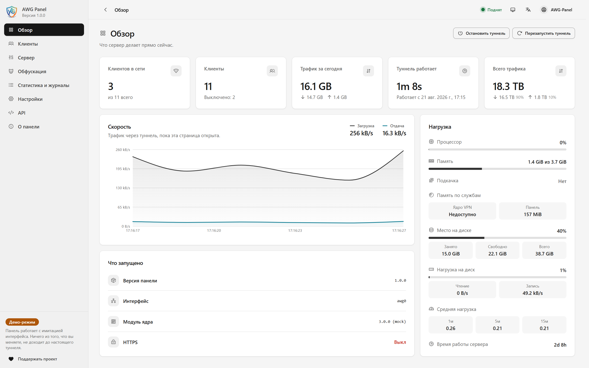

<div align="center">

[English](README.md) &nbsp;·&nbsp; **Русский**


# AWG Panel

### Stealth VPN-сервер, который настраивается сам

**AmneziaWG + современная веб-панель. Одна команда, один сервер, тысячи клиентов — невидимо для DPI.**

<br>

[](https://github.com/achiliies/awg-panel/releases)
[](https://github.com/achiliies/awg-panel/actions/workflows/ci.yml)
[](LICENSE)
[](#installation)

<br>

[Почему AmneziaWG и почему AWG Panel?](#почему-amneziawg-и-почему-awg-panel) &nbsp;·&nbsp; [Возможности](#возможности) &nbsp;·&nbsp; [Подключение устройств](#подключение-устройств) &nbsp;·&nbsp; [Установка](#установка) &nbsp;·&nbsp; [Отказ от ответственности](#отказ-от-ответственности) &nbsp;·&nbsp; [Поддержка проекта](#поддержка-проекта)

</div>

---

## Почему AmneziaWG и почему AWG Panel?

WireGuard — лучшее, что случалось с VPN: компактный современный протокол, обгоняющий любые устаревшие альтернативы и почти не нагружающий процессор. У него есть ровно одна слабость: его handshake настолько узнаваем, что DPI-оборудование вычисляет его по первому же пакету.

**AmneziaWG закрывает эту уязвимость, ничем не жертвуя.** Это абсолютно та же криптография и путь данных WireGuard, упакованные в маскировку каждого соединения: мусорные пакеты, случайные заголовки, отвлекающий трафик — благодаря чему файрвол видит случайный шум там, где раньше безошибочно опознавался VPN.

**Половина магии — в том, где именно выполняется шифрование.** AmneziaWG поставляется в двух вариантах: реализация на Go в userspace, которую ставят в большинстве руководств из-за простоты, и полноценный модуль ядра Linux — тот самый скоростной путь, которым знаменит сам WireGuard. Внутри ядра пакеты шифруются прямо по месту: ничего не копируется в отдельный процесс и обратно, нет лишних переключений контекста и задержек. Модуль ядра сложнее в установке: его нужно компилировать под конкретное ядро и пересобирать при каждом обновлении ядра — и именно эту задачу **AWG Panel** берет на себя: собирает из исходников на вашем сервере, автоматически поддерживает работоспособность при обновлениях ядра без необходимости вручную запускать компилятор.

Вместе они представляют собой самое легковесное, быстрое, энергоэффективное и устойчивое к DPI решение из существующих:

- **Легковесность.** Никаких цепочек прокси, TLS-оберток и стека фоновых служб — AmneziaWG сохраняет знаменитую компактность WireGuard и добавляет маскировку, а не лишний слой. Система без труда помещается на VPS за $5.
- **Скорость.** Маскировка применяется к handshake, а не к самим данным. Как только туннель поднят, трафик идет в точности как обычный трафик WireGuard — чистый UDP от начала до конца, без проблемы «TCP-in-TCP meltdown» (когда два алгоритма контроля перегрузки конфликтуют друг с другом) и без локальных прокси-цепочек, пересобирающих каждый пакет на устройстве. Это самый быстрый VPN-протокол на сегодняшний день, и качественный клиент передает эту скорость без потерь.
- **Скорость ядра на сервере.** Когда туннель обрабатывается модулем ядра, тот же VPS пропускает больше трафика при меньшей нагрузке на процессор, меньше греется под нагрузкой и обслуживает больше клиентов до возникновения просадок — пропускная способность, недостижимая для userspace-решений.
- **Бережное отношение к батарее.** Полная тишина в режиме ожидания: никакого постоянного фонового обмена keep-alive пакетами и поддержки активных TLS-сессий. Каждый пакет шифруется один раз и отправляется — он никогда не передается в userspace-прокси для распаковки и повторной запаковки. В результате процессор обрабатывает его лишь единожды, а радиомодуль и ядра процессора вашего смартфона могут спокойно уходить в спящий режим. Ни одно решение на базе обфусцированного TLS не способно дать такой энергоэффективности.
- **Невидимость для DPI.** Любой сигнатурный признак, по которому цензоры выявляют трафик — размер handshake, константы в заголовках, периодичность пакетов — рандомизируется индивидуально для каждого сервера. Сигнатуры, под которую можно было бы написать правило фильтрации, просто нет.
- **Все тот же надежный WireGuard.** Рукопожатие Noise и шифрование ChaCha20-Poly1305 остаются нетронутыми. Вы получаете маскировку поверх проверенной аудитом криптографии, а не вместо нее.

| | **AmneziaWG** | OpenVPN + stealth-патчи | V2Ray / Xray |
|---|---|---|---|
| **Скорость** | Пропускная способность уровня WireGuard | Userspace, ограничено процессором | Накладные расходы цепочки прокси |
| **Батарея** | Радиомодуль спит, когда нет трафика | Постоянный keep-alive обмен | Непрерывные TLS-сессии |
| **Потребление ресурсов** | Как у WireGuard, ничего лишнего | Демон плюс TLS-стек | Демон плюс многослойные конфигурации |
| **Устойчивость к DPI** | Рандомизируется для каждого сервера | Известные сигнатуры | Надежная, но дорогой ценой |

## Возможности

<div align="center">



<sub>Панель управления в реальном времени. &nbsp;·&nbsp; <b><a href="SCREENSHOTS.md">Другие скриншоты →</a></b></sub>

</div>

<br>

AmneziaWG — это двигатель. **AWG Panel — это все вокруг него**: установка, настройка и управление без лишних хлопот:

<table>
<tr>
<td width="33%" valign="top"><b>Продвинутое управление клиентами</b><br><sub>Создание клиента в один клик и передача QR-кода или файла конфигурации. Сроки действия, квоты на трафик, заметки, мгновенная блокировка и разблокировка — применяются автоматически, а не «на честном слове».</sub></td>
<td width="33%" valign="top"><b>Высокая производительность</b><br><sub>Тот самый модуль ядра, без головной боли: собирается из исходников, регистрируется в DKMS для сохранения при обновлениях ядра и перезагружается на лету при обновлениях. Сама панель не участвует в маршрутизации пакетов — VPN работает на полной скорости независимо от того, запущена панель или нет.</sub></td>
<td width="33%" valign="top"><b>Простота использования</b><br><sub>Понятный современный веб-интерфейс для всего — не нужно вручную редактировать конфиги или читать man-страницы. Редактор обфускации объясняет каждый параметр простым языком прямо во время настройки.</sub></td>
</tr>
<tr>
<td valign="top"><b>Установка одной командой</b><br><sub>Одна команда на чистом сервере: компилирует, настраивает, открывает порты в файрволе, проводит полный сквозной самотест и выводит URL панели и пароль. Считанные минуты вместо целого вечера.</sub></td>
<td valign="top"><b>Резервное копирование и восстановление</b><br><sub>Один архив содержит ключ сервера, всех клиентов, все настройки и полную историю трафика. Восстановите его на новом сервере — и все ранее выданные конфиги продолжат работать.</sub></td>
<td valign="top"><b>Контроль пропускной способности</b><br><sub>Ограничения скорости и квоты трафика для каждого клиента, применяемые на лету и сохраняющиеся после перезагрузок. Один активный пользователь не сможет занять весь канал сервера.</sub></td>
</tr>
<tr>
<td valign="top"><b>Грамотный IPv6</b><br><sub>Полноценный Dual-Stack в конфигурации каждого клиента. Нативная маршрутизация, NAT или защищенный от утечек blackhole — определяются автоматически для каждого сервера, исключая утечки IPv6-трафика в обход туннеля.</sub></td>
<td valign="top"><b>Информативный дашборд</b><br><sub>Скорость в реальном времени, история трафика по клиентам и счетчики за все время, сохраняющиеся после перезапусков и перезагрузок: ядро забывает данные, а панель — нет.</sub></td>
<td valign="top"><b>Уникальный stealth-профиль</b><br><sub>Параметры обфускации генерируются индивидуально для каждого сервера и никогда не используют одинаковые стандартные значения: общая для всех сигнатура — это не маскировка, а готовая мишень для правил блокировки.</sub></td>
</tr>
<tr>
<td valign="top"><b>Защищенная панель</b><br><sub>Двухфакторная аутентификация, TLS, секретный путь в URL для защиты страницы входа от сканеров, именные API-токены со сроком действия и подробный журнал действий.</sub></td>
<td valign="top"><b>Полноценный REST API</b><br><sub>Все, что делает панель, можно автоматизировать скриптами — со встроенной документацией по API с поиском и схемой OpenAPI прямо на вашем сервере.</sub></td>
<td valign="top"><b>Масштабируемость из коробки</b><br><sub>Более 4 000 клиентов по умолчанию; расширьте подсеть в панели — и тот же сервер сможет адресовать до 16 миллионов устройств. Безопасные обновления на месте и скрипт полного удаления включены.</sub></td>
</tr>
</table>

## Подключение устройств

Откройте панель, выберите клиента, отсканируйте QR code — или скачайте файл `.conf` и импортируйте его в любое из этих приложений:

<table>
<tr>
<th>Android</th>
<th>Windows</th>
<th>iOS</th>
<th>Linux</th>
</tr>
<tr>
<td align="center" valign="top">
<b>WG Tunnel</b><br><sub>многофункциональный · рекомендуемый</sub><br><br>
<a href="https://play.google.com/store/apps/details?id=com.zaneschepke.wireguardautotunnel"></a><br>
<a href="https://github.com/wgtunnel/android/releases/tag/5.6.0"></a><br>
<sub>APK v5.6.0</sub>
<br><br>
<b>AmneziaWG</b><br><sub>официальный · минималистичный</sub><br><br>
<a href="https://play.google.com/store/apps/details?id=org.amnezia.awg"></a><br>
<a href="https://github.com/amnezia-vpn/amneziawg-android/releases/tag/v3.1.20260814"></a><br>
<sub>APK v3.1.20260814</sub>
</td>
<td align="center" valign="top">
<b>AmneziaWG</b><br><sub>официальный клиент</sub><br><br>
<a href="https://github.com/amnezia-vpn/amneziawg-windows-client/releases/tag/3.1.0"></a><br>
<sub>v3.1.0</sub>
</td>
<td align="center" valign="top">
<b>AmneziaWG</b><br><sub>официальный клиент</sub><br><br>
<a href="https://apps.apple.com/us/app/amneziawg/id6478942365"></a>
</td>
<td align="center" valign="top">
<b>amneziawg-tools</b><br><sub>awg-quick</sub><br><br>
<a href="https://github.com/amnezia-vpn/amneziawg-tools"></a>
</td>
</tr>
</table>

**Какое приложение выбрать для Android?** Официальное приложение **AmneziaWG** намеренно сделано минималистичным — импортировал, подключился, готово — и это самый легковесный способ подключиться к туннелю. **WG Tunnel** также поддерживает AmneziaWG и добавляет расширенные возможности: раздельное туннелирование для отдельных приложений (split tunneling), автоподключение в ненадежных сетях Wi-Fi, Kill Switch, режим Always-On VPN и работу с несколькими туннелями с правилами для разных сетей.

**Ставьте версии, указанные выше.** Сервер, установленный этим релизом, включает случайные хвосты пакетов, а это настройка AmneziaWG 3.1: клиент ниже 3.1 отбрасывает рукопожатие, и ошибки не появляется ни на одной стороне. В WG Tunnel поддержка 3.1 появилась в **5.6.0**, в клиенте Amnezia VPN — в **5.0.1.5**, поэтому сборка постарее не подключится, пока вы её не обновите — либо пока не очистите `RandomTrailers` на странице обфускации. Приложения AmneziaWG по ссылкам выше уже собраны на 3.1.

**В Linux (консоль / CLI)**: установите `amneziawg-tools` и модуль ядра — пользователи Ubuntu могут установить и то, и другое из [Amnezia PPA](https://launchpad.net/~amnezia/+archive/ubuntu/ppa) (`sudo add-apt-repository ppa:amnezia/ppa`), на остальных дистрибутивах потребуется сборка из репозитория выше — затем поднимите туннель командой `sudo awg-quick up ./client.conf`.

**Нужен графический интерфейс (GUI) для Linux или macOS?** Полнофункциональное приложение [Amnezia VPN](https://github.com/amnezia-vpn/amnezia-client/releases) полностью совместимо с файлами конфигураций из этой панели и предоставляет удобный графический интерфейс для **Linux**, **macOS** и **Windows** (а также доступно в [Google Play](https://play.google.com/store/apps/details?id=org.amnezia.vpn) и [App Store](https://apps.apple.com/us/app/amneziavpn/id1600529900)). Поскольку оно содержит в себе полный мультипротокольный набор, оно немного тяжелее специализированных утилит из таблицы выше.

## Установка

Две команды на чистом сервере с **Ubuntu или Debian** с правами root:

```bash
curl -fsSLO https://github.com/achiliies/awg-panel/releases/latest/download/get.sh
sudo bash get.sh
```

Это вся установка. Команда скачивает установщик последнего релиза, сверяет его с файлом `SHA256SUMS`, опубликованным рядом с ним, и запускает только при совпадении контрольных сумм. Дальше скрипт собирает модуль ядра AmneziaWG под ваше текущее ядро — а также под более новое, если оно уже установлено и ждет перезагрузки, — и регистрирует его в DKMS, чтобы он сохранялся при обновлениях ядра, создает конфигурацию сервера с профилем обфускации, сгенерированным индивидуально для этой машины, устанавливает панель и создает вашего первого клиента.

Скрипт содержит исходный код модуля и утилит, зафиксированный на проверенных коммитах, скомпилированный веб-интерфейс панели и все необходимые Python-wheels, поэтому он ничего не клонирует через git и не обращается к индексам пакетов. Единственный сетевой доступ, который ему нужен — это `apt` для установки `build-essential`, `dkms` и заголовков ядра. Ничего предварительно устанавливать не нужно — ни Node, ни Python, ни веб-сервер.

Все флаги из разделов ниже работают и здесь: `sudo bash get.sh --lang ru --panel-port 8443`; любые аргументы передаются установщику напрямую.

### Команда в одну строку и почему она теперь вторая

```bash
curl -fsSL https://github.com/achiliies/awg-panel/releases/latest/download/get.sh | sudo bash
```

Тот же скрипт, та же проверка контрольной суммы, та же установка — но начиная с Ubuntu 25.10 она не может ничего у вас спросить и сообщает об этом при запуске. В этих выпусках `sudo` — это `sudo-rs`: он запускает переданную команду в собственном псевдотерминале (pty) и передает в него данные со своего стандартного ввода. В конвейере этот ввод принадлежит `curl`, а не вам, поэтому `/dev/tty` внутри установщика — это терминал, до которого не доходит ни одно нажатие клавиши. Установка при этом проходит полностью, просто на каждый вопрос берется значение по умолчанию. Там, где `sudo` — это классическая реализация на C (Ubuntu 24.04, Debian), никакой pty не создается и вопросы задаются как обычно.

Поэтому такая форма остается правильной для автоматической установки без участия оператора и принимает флаги через `bash -s --`:

```bash
curl -fsSL https://github.com/achiliies/awg-panel/releases/latest/download/get.sh \
  | sudo bash -s -- --no-ask --lang ru --panel-port 8443
```

Если вы предпочитаете скачать сам установщик, а не скрипт, который его получает, бандл доступен отдельным файлом:

```bash
curl -fsSLO https://github.com/achiliies/awg-panel/releases/latest/download/awg-panel.sh
sudo bash awg-panel.sh
```

Именно это и делает `get.sh` — за вычетом проверки контрольной суммы, которую в этом случае стоит выполнить самостоятельно: как именно, описано в разделе [Проверка контрольных сумм](#проверка-контрольных-сумм). В любом случае установщик должен существовать в виде файла: он считывает встроенный архив из собственного хвоста, а не держит его в памяти, поэтому его нельзя передать в `bash` через pipe. `get.sh` — это как раз тот небольшой скрипт, который скачивает установщик, проверяет его и запускает.

Если с сервера нет доступа к GitHub, разместите релиз на доступном зеркале и направьте туда ту же команду:

```bash
curl -fsSL https://your.mirror/releases/latest/download/get.sh \
  | sudo env AWG_PANEL_RELEASE_URL=https://your.mirror/releases bash
```

Переменная `AWG_PANEL_VERSION=v1.2.3` устанавливает конкретный релиз вместо последнего, а `AWG_PANEL_UPDATE_REPO=owner/repo` — установку из форка: панель читает ту же переменную при проверке обновлений, поэтому форк продолжит обновляться из самого себя.

Для работы требуется около 1.5 ГБ свободного места на диске и 450 МБ свободной оперативной памяти — скрипт проверяет оба параметра перед началом работы. Память нужна компилятору, и эта проверка необходима, поскольку при нехватке памяти во время сборки модуля ядра система не выдает понятной ошибки: OOM-киллер просто аварийно завершает всю сессию входа, из-за чего SSH-сессия или окно `tmux` внезапно закрываются посреди процесса без каких-либо сообщений. Если проверка завершилась ошибкой, добавьте на сервер 1 ГБ swap-пространства и запустите установку снова. При обновлении уже запущенная панель учитывается в этом объеме памяти, так как продолжает работать во время сборки новой версии.

По завершении скрипт выводит эндпоинт туннеля, URL панели и учетные данные для входа. Обе части учетных данных генерируются случайным образом: имя пользователя выбирается случайно, а не стандартный `admin`, поэтому даже если страницу входа обнаружат, злоумышленнику придется подбирать и логин, и пароль. **Обязательно сохраните их — они показываются только один раз.** В дальнейшем добавление, отключение клиентов и назначение квот осуществляются через панель, а управление самим сервером — с помощью команды `sudo awg-menu`.

> [!IMPORTANT]
> Установщик открывает UDP-порт туннеля в локальном файрволе сервера, но не может настроить файрвол вашего хостинг-провайдера. В AWS, GCP, Oracle Cloud и аналогичных облачных сервисах обязательно добавьте соответствующее входящее правило для UDP в группу безопасности (Security Group) вашего инстанса, иначе подключение не удастся установить.

### Язык

Перед началом установки скрипт задает один вопрос, и по нажатию Enter продолжает на
английском:

```
  Language / Язык
  Press Enter to continue in English.
  Введите "ru", чтобы продолжить установку на русском языке.

  [Enter = en]:
```

Ответить на него из командной строки можно флагом `--lang ru`, а `--no-ask` (как и любой
запуск в среде без интерактивного терминала) выбирает английский, ничего не спрашивая.
Ответ распространяется на саму установку — на этот скрипт и на установщик панели, который
тот запускает, — и записывается в файл `/etc/amnezia/amneziawg/language`. Поэтому команда
`sudo awg-menu` затем открывается на том же языке, а повторный запуск установщика предлагает
этот язык как выбор по умолчанию (по Enter), а не спрашивает заново. Пункт меню **Язык**
меняет его в любой момент и записывает новый ответ в тот же файл.

Интерфейс панели в браузере — отдельная история: у него собственная настройка языка в
разделе **Settings**, которую каждый входящий выбирает для себя. То же касается всего, что
меню лишь показывает — вывода `certbot`, журнала, `awg show`: это остается на том языке, на
котором говорят сами эти программы.

### Выбор собственных настроек

При первой установке мастер задает вопросы только один раз. Это происходит после того, как модуль ядра собран и зарегистрирован, а утилиты установлены — на этапе, когда успех установки практически гарантирован — и до того, как какие-либо данные будут записаны в `/etc`, так что при любом ответе ничего лишнего не произойдет:

```
  ---- 3/6  Порт панели ----------------------------------------------
       TCP-порт, на котором отвечает веб-панель. Открывается в фаерволе
       этой машины; в облачной security group правило всё равно вручную.

       порт панели [Enter = 2097]:
```

Всего шесть вопросов: порт VPN, вместимость туннеля по количеству клиентов, порт веб-панели, ее секретный путь в URL, а также имя пользователя и пароль для входа. Для каждого пункта значение по умолчанию указано в `[квадратных скобках]`, и нажатие клавиши **Enter** выбирает его. Все значения по умолчанию полностью рабочие, поэтому простое нажатие Enter шесть раз подряд выполнит стандартную установку.

Параметры, переданные через аргументы командной строки, повторно не запрашиваются, как и параметры, уже настроенные на работающем сервере — поэтому при обновлении вопросы о порте, подсети и адресе панели не задаются повторно. Исключением являются имя пользователя и пароль: учетная запись сохраняется при любых переустановках, поэтому при обновлении запрос все равно отображается: нажатие **Enter** сохраняет текущие данные, а ввод нового имени или пароля перезаписывает их. Это удобный способ восстановить доступ к панели, если пароль был утерян. Флаг `--no-ask` (а также любой запуск в среде без интерактивного терминала) автоматически принимает все значения по умолчанию без лишних вопросов:

| Флаг | По умолчанию | |
|---|---|---|
| `--port N` | случайно, 20000–59999 | UDP-порт, к которому подключаются клиенты |
| `--endpoint IP` | определяется автоматически | публичный адрес, если автоопределение ошиблось |
| `--subnet CIDR` | `10.13.0.0/20` | задает вместимость клиентов: `/24` — 253, `/20` — 4093, `/16` — 65533; `/16` — самая широкая допустимая сеть, `/30` — самая узкая |
| `--ipv6 MODE` | `auto` | `native`, `nat`, `blackhole` или `off` |
| `--panel-port N` | `2097` | порт, на котором слушает панель |
| `--client NAME` | `client1` | имя создаваемого клиента |
| `--lang CODE` | спрашивает, затем `en` | `en` или `ru`: язык, на котором говорит установщик |
| `--no-ask` | запрашивает | применить все значения по умолчанию без интерактивных вопросов |

Команда `sudo bash awg-panel.sh --help` выводит полный список всех флагов; то же самое делают `sudo bash get.sh --help` и `curl -fsSL .../get.sh | sudo bash -s -- --help`.

### Обновление

Сервер обновляется автоматически. Пункт меню **Settings → Updates** в панели или **Update** в `sudo awg-menu` проверяет наличие свежего стабильного релиза на GitHub и отображает найденную версию — `1.0.0 → 1.1.0`, вместе со списком изменений. При подтверждении система создает полную резервную копию, скачивает релиз, сверяет его с опубликованным файлом `SHA256SUMS`, устанавливает и сообщает о статусе перезапуска панели и туннеля. То же самое можно сделать из терминала:

```bash
sudo awg-update check
sudo awg-update apply
```

Конфигурация, ключ сервера, клиенты, учетные записи, квоты и история трафика полностью сохраняются, а пересобранный модуль подменяется на лету без перезагрузки системы. Предлагаются только стабильные релизы; кандидаты в релизы (release candidates) никогда не устанавливаются автоматически. Все подробности, включая переключение на форк или зеркало и действия при возникновении ошибок, описаны в **[docs/UPDATES.md](docs/UPDATES.md)**.

Повторный запуск скрипта установки вручную также выполняет обновление — именно его и запускает утилита `awg-update`. Используйте флаг `--fresh` только в том случае, если вы действительно хотите сгенерировать конфигурацию заново с нуля.

### Проверка контрольных сумм

Каждый релиз сопровождается файлом `SHA256SUMS` рядом со скриптами установки:

```bash
curl -fsSLO https://github.com/achiliies/awg-panel/releases/latest/download/SHA256SUMS
sha256sum -c SHA256SUMS --ignore-missing
```

Установка одной командой уже выполняет эту проверку — именно ради нее существует `get.sh`, а не просто `curl | bash` с самим установщиком, — и обновление из панели тоже. Этот раздел нужен для установщика, скачанного вручную, и для проверки самого `get.sh`, который перечислен в том же файле.

Предпочитаете лично изучить то, что запускаете? На странице [Releases](https://github.com/achiliies/awg-panel/releases) также доступен архив с исходным кодом, в который уже включены собранный интерфейс и wheels-пакеты.

### Нашли уязвимость?

Сообщите о ней приватно, через [Security → Report a vulnerability](https://github.com/achiliies/awg-panel/security/advisories/new), а не обычным issue. Issue становится публичным в момент создания, а это ПО хранит приватные ключи всех клиентов на сервере, которым кто-то пользуется прямо сейчас. В **[docs/SECURITY.md](docs/SECURITY.md)** описано, что выполняется от root, что и где хранится и какие острые углы уже известны.

## Отказ от ответственности

> [!WARNING]
> **Это программное обеспечение не предназначено для коммерческой эксплуатации (production).** AWG Panel предоставляется для исследовательских, образовательных целей и личного использования.
> Проект не проходил независимый аудит безопасности. Не используйте его для защиты критически важной инфраструктуры, компрометацию которой вы не можете себе позволить, и запускайте только на серверах, которыми вы владеете или имеете явное разрешение на использование.

> [!IMPORTANT]
> - **Знайте законодательство.** Законность использования VPN и средств обфускации трафика различается в зависимости от страны. Вы и только вы несете ответственность за то, чтобы установка и использование этого ПО соответствовали законодательству вашей страны и юрисдикции вашего сервера.
> - **Маскировка (stealth) — это не анонимность.** AmneziaWG скрывает туннель от DPI; он не делает вас анонимным в сети и не дает разрешения на действия, являющиеся незаконными без него.
> - **Отсутствие гарантий.** Данное программное обеспечение предоставляется на условиях *«как есть»* (*"as is"*), без каких-либо явных или подразумеваемых гарантий — см. разделы 15–16 лицензии [AGPL-3.0](LICENSE). Авторы не несут ответственности за любые последствия использования ПО вами или третьими лицами.

## Поддержка проекта

AWG Panel — свободное программное обеспечение и всегда останется таковым. Если проект полезен для вашего сервера и вы хотите поддержать его дальнейшее развитие, пожертвования помогают выделять время на разработку — мы будем рады поддержке в любой из криптовалют ниже. Список сгенерирован из той же таблицы, что и страница поддержки в самой панели, поэтому адреса всегда совпадают.

<!-- wallets:begin (translated by hand from README.md; keep addresses in sync — see panel/wallet-codes.py) -->
<details>
<summary><b>Bitcoin</b> · BTC</summary>

```
bc1qzx3s920ztkk3njhyl9txq8gxxydg2rl04njm7g
```

</details>
<details>
<summary><b>Ethereum</b> · ETH</summary>

```
0x91c814582232cd4dc801a994d63ecbcc37411703
```

</details>
<details>
<summary><b>Monero</b> · XMR</summary>

```
85C7MLNzDsMde6dnrZUpA4VerPH8431eYBoMrFL4dgk7SRvdn7YJCppZDX2StbpMNeYRqAodnUkwb6k7aPZ43T4vRpWoDA3
```

</details>
<details>
<summary><b>Tether USD</b> · USDT · TRC-20 (TRON)</summary>

```
TAWLzQfTKbQmqyZkzG99mBfC1QqNHmndAb
```

</details>
<details>
<summary><b>Tether USD</b> · USDT · BEP-20 (BNB Smart Chain)</summary>

```
0x91c814582232cd4dc801a994d63ecbcc37411703
```

</details>
<details>
<summary><b>Solana</b> · SOL</summary>

```
H7qwxBj6WPcnsWAu5vfEqD7DsJ1rvjYgoerNRnfNo9q
```

</details>
<details>
<summary><b>TRON</b> · TRX</summary>

```
TAWLzQfTKbQmqyZkzG99mBfC1QqNHmndAb
```

</details>
<details>
<summary><b>XRP</b> · XRP Ledger</summary>

```
rpcvSW6d86UbDMpCLD76VpXn53vbiAeECm
```

</details>
<details>
<summary><b>Litecoin</b> · LTC</summary>

```
ltc1qyj3ppadclkryerwhqyj836eszy05p69ekw40g5
```

</details>
<details>
<summary><b>Bitcoin Cash</b> · BCH</summary>

```
bitcoincash:qrzghlwlrmq8nrj5hkdwxl968jfy7tgexywffezd48
```

</details>
<!-- wallets:end -->

## Лицензия

[AGPL-3.0](LICENSE). Панель является сетевым сервисом, поэтому действует раздел 13: если вы предоставляете доступ к модифицированной версии для других пользователей, вы обязаны предоставить им доступ к ее исходному коду. Использование без изменений не накладывает на вас никаких обязательств. Модуль ядра AmneziaWG и утилиты, собираемые установщиком, являются разработкой [апстрима](https://github.com/amnezia-vpn) и распространяются под собственными лицензиями.

Пулл-реквесты и патчи приветствуются — см. [CONTRIBUTING.md](CONTRIBUTING.md).

---

<div align="center">
<sub>Если AWG Panel полезна для вас, звезда репозиторию поможет другим найти этот проект.</sub><br>
<sub>«WireGuard» и логотип «WireGuard» являются зарегистрированными товарными знаками Джейсона А. Доненфельда (Jason A. Donenfeld). Этот проект никак не связан с WireGuard или Amnezia.</sub>
</div>
