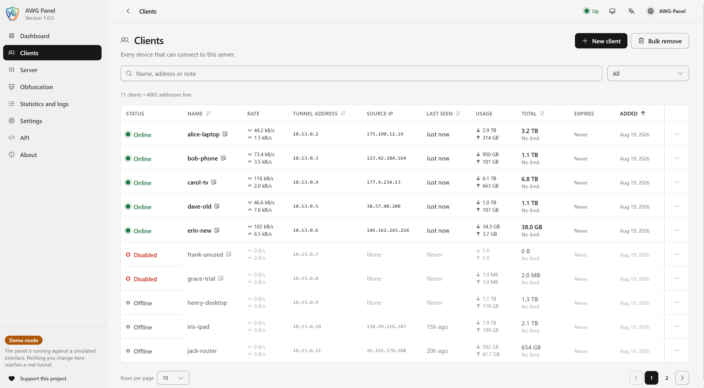
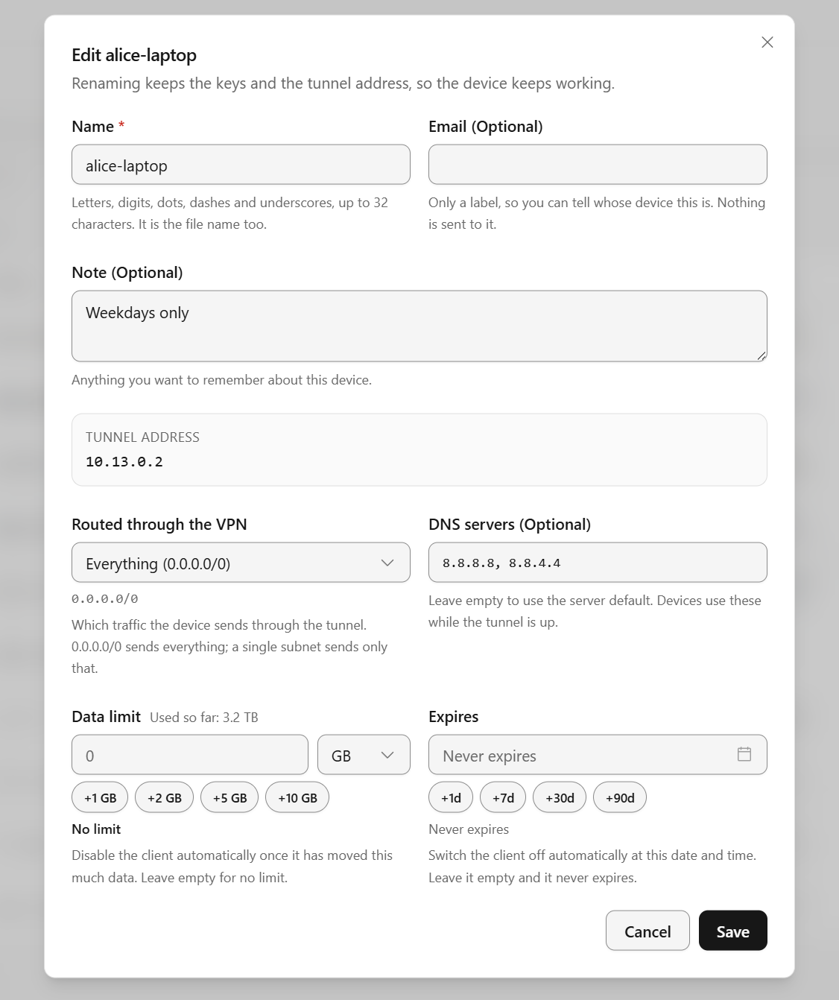
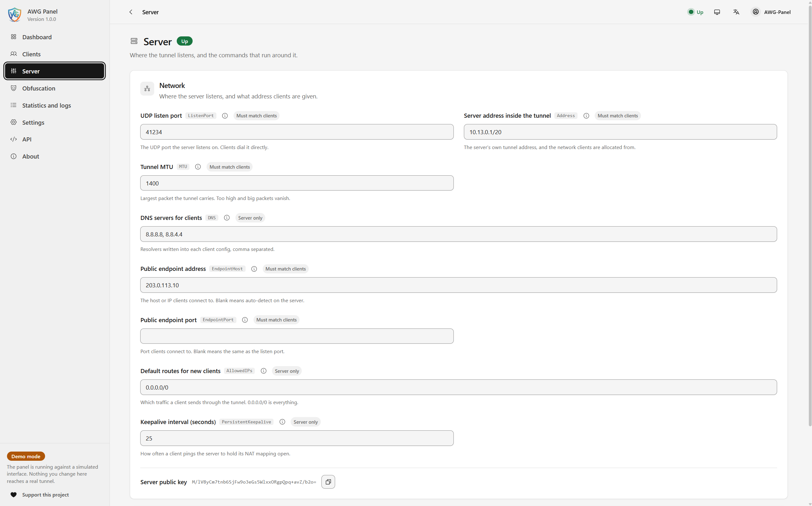
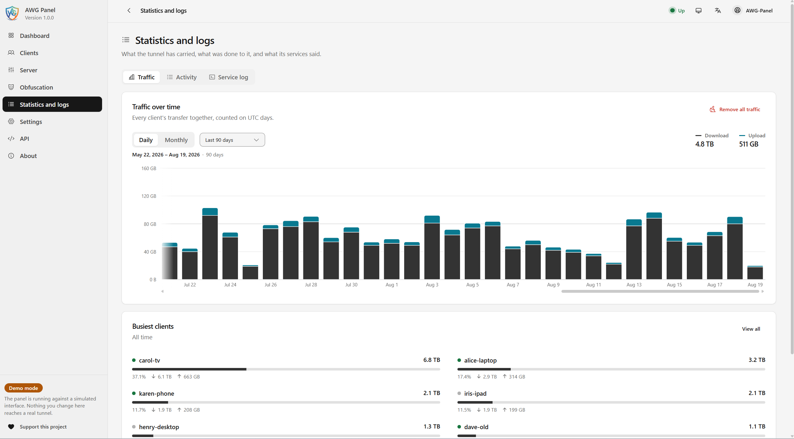

# Screenshots

<a href="README.md">← Back to the README</a>

---

Every page below is the panel as it ships, running against its own simulated
interface — `make demo`, described in [docs/DEVELOPMENT.md](docs/DEVELOPMENT.md).
The layout, the copy and the controls are the real thing; only the clients and
the traffic behind them are seeded, so nothing here is anybody's actual server.

## Dashboard

What the server is doing right now: clients online against clients that exist,
traffic today, how long the tunnel has been up, and an all-time total that
survives restarts — the kernel forgets its counters, the panel doesn't. The
throughput chart draws live while the page is open, and the tunnel can be
stopped or restarted from the two buttons above it.

## Clients

Every device that can connect, in one table — status, current rate, tunnel
address, where it last connected from, and what it has moved in each direction
against whatever limit it was given. Search by name, address or note, filter by
state, and act on one client or on a selection.

## Editing a client

Everything a client carries, with each field explaining itself. Renaming keeps
the keys and the tunnel address, so the config already on the device goes on
working. Data limits and expiry dates are enforced by the server — the client
is switched off when it crosses either — and the quick buttons beneath them add
a gigabyte or a week without arithmetic.

## Server

Where the tunnel listens and what every client is handed. Each setting shows
the `awg` key it writes, and a badge saying whether changing it invalidates the
configs already issued — `Must match clients` means existing devices need their
config again, `Server only` means they do not.

## Statistics and logs

What the tunnel has carried, what was done to it, and what its services said.
Traffic is counted on UTC days and kept per client, daily or monthly, over
whatever window you pick; the busiest clients are ranked underneath it. The
other two tabs hold the activity log — who signed in and what they changed —
and the service log straight from the units behind the panel.

---

<a href="README.md">← Back to the README</a> &nbsp;·&nbsp; <a href="README.md#installation">Installation</a>

